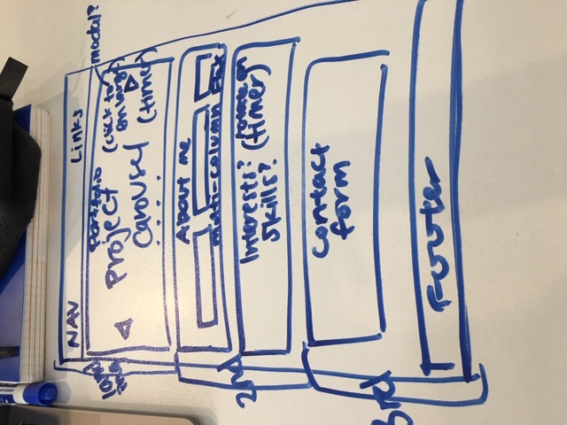

# Project 0 - About Me

### Overview
This is my first project as a WDI student at General Assembly SF.  I have used the skills I've learned so far in HTML, CSS, JavaScript, and jQuery to build a website About Me.

---
## Technologies Used
- Bootstrap
- jQuery

### References
I used previous homework and exercises to aid my creating flexboxes.

For the carousel slideshow of my past projects, I read this <a href="https://www.w3schools.com/howto/howto_js_slideshow.asp">W3Schools tutorial</a> and ultimately used <a href="https://getbootstrap.com/docs/4.0/components/carousel/">Bootstrap's carousel component</a>.  I also applied <a href="https://getbootstrap.com/docs/4.0/components/scrollspy/">Bootstrap's scrollspy component</a> to reflect in the nav bar the user's current position on the page.

This <a href="https://www.w3schools.com/jquery/tryit.asp?filename=tryjquery_eff_animate_smoothscroll">W3Schools question</a> helped me work through the smooth scrolling task.

I searched on Stack Overflow for many questions I had for the JS functions.
To try fading content in and out of my skills section, I referenced this <a href="https://stackoverflow.com/questions/3670487/jquery-text-fade-transition-from-one-text-to-another">thread</a>, but I could not figure it out all the way.

For the responsive collapsible nav, I used <a href="https://getbootstrap.com/docs/4.0/components/dropdowns/">Bootstrap's dropdown component</a> as well as this <a href="https://www.w3schools.com/howto/howto_js_media_queries.asp">W3Schools page</a>; however, this I also could not solve all the way.

---
## My Process/Approach
Throughout this project, I edited this README file after completing or attempting each step in order to take notes for futureMe.

I started by going through the requirements that the site should contain.  I then created a wireframe to help me visually lay out my sections and what they might be.

From there, I wrote pseudocode in my HTML, CSS, and JS files to write down what content I needed to include, what styles or layout I needed to apply, and what functions to implement.  After ensuring I had all points and requirements written in pseudocode, I began to build out my HTML, starting with a boilerplate.

Once I had my content blocked in my HTML, I started working on CSS styles to change the layout.

After getting the basic layout accomplished with margins and padding adjusted, I got started on the more complex requirements of the project, beginning with the portfolio carousel.

I spent a few hours attempting to create the lightbox, but after not succeeding, I decided to manage my time and move on to the next functionalities of the nav bar allowing for smooth scrolling to sections and for highlighting the corresponding nav item for the current section.

I was able to complete those tasks, though not as polished as would be ideal.  I then tried to solve the responsive collapsible dropdown hamburger nav, but encountered a few issues there.

Finally, I went back to my CSS file to apply more styles to my liking.

---
## Unsolved Problems
- Getting all images in the carousel to be the same size, and therefore not interrupting the placement of the captions.
- None of the Boostrap components work when visiting the site hosted on Github.
- Lightbox
- Getting the nav links to highlight and scroll to the top of the section vs. at or after the section's headline
- Although I changed the nav active styles, Bootstrap's native active styles seem to linger for a second, primarily the whole link having a background color of white.
- Getting the nav to collapse into a dropdown hamburger menu upon resizing the window.  If you set the window to a normal size before loading the page, the nav appears normally, but if you resize it to a smaller window, the nav links do not collapse into the hamburger icon.  However, if you were to leave the window at the smaller size and reload or load the page, the hamburger contains the dropdown menu.  But upon resizing it back to a larger size, the hamburger icon and the full nav disappear completely.
- Getting the Skills section to animate and switch between divs vs. fade in and out the whole section.

---
## My Biggest Wins and Challenges
Without fail, I struggle with flexbox, so I was very happy to achieve the flexbox effects I wanted in both the header and the contact form.

I searched for methods to create a carousel from scratch, but struggled with the tutorials and community posts I found.  I let myself look at the given Bootstrap version, and it all made sense and worked!  However, no matter how many times I attempted at creating a modal to create a lightbox, I did not succeed.  I tried Bootstrap's modal component; I googled other modal and lightbox tutorials.

My biggest challenges are the problems I couldn't solve listed above.
